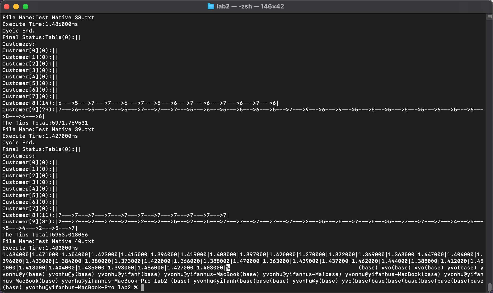
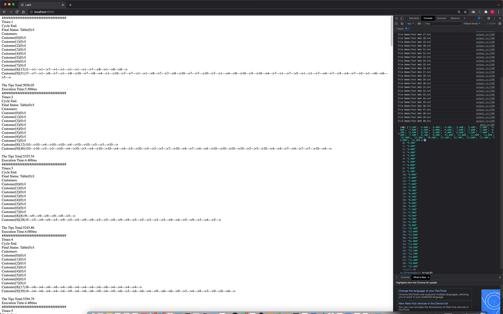
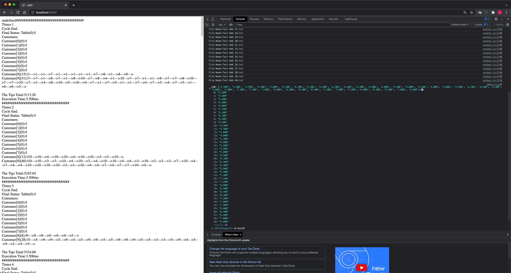
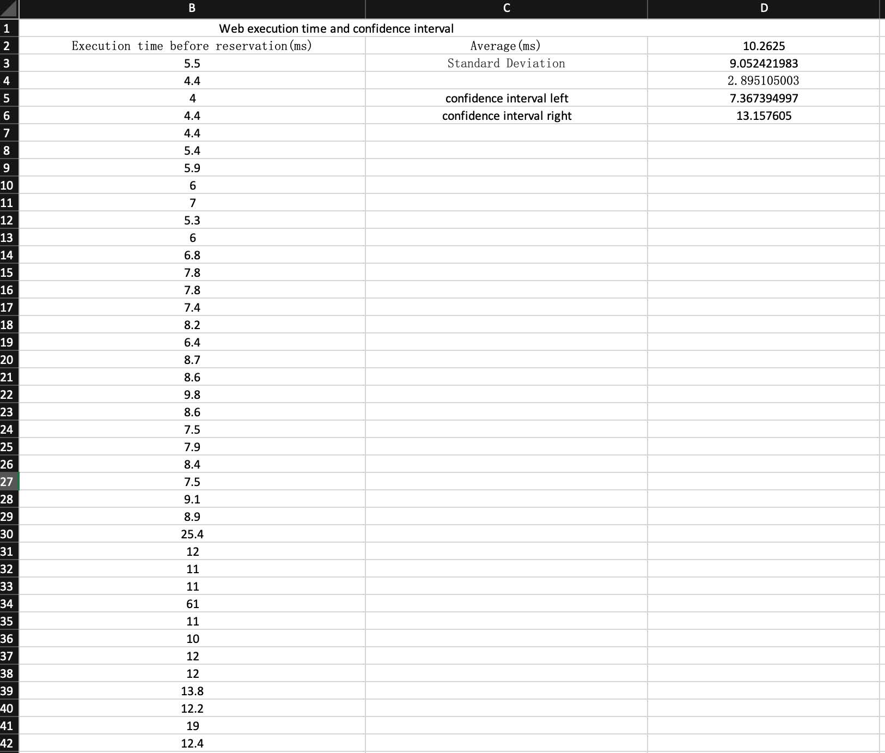
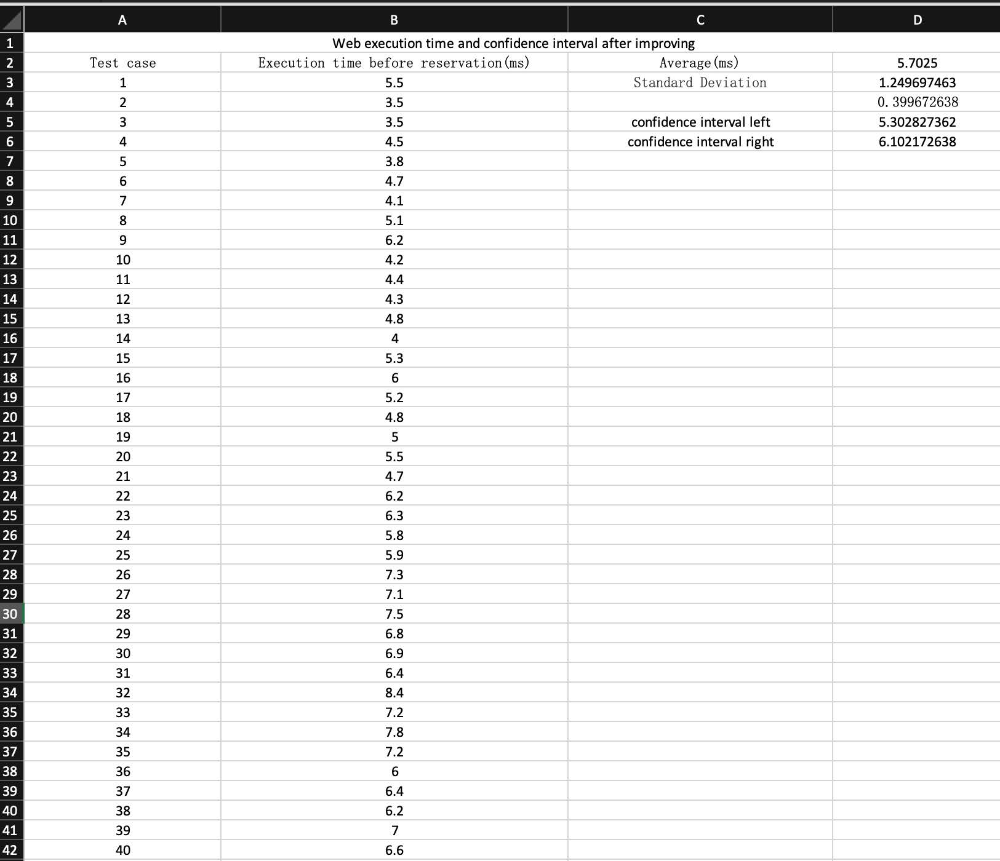

## Welcome to GitHub Pages (Lab2)

### ***Back to [Home](https://xinghuadong.github.io/blog.github.io/)***

### ***[Download](https://github.com/Yvonhu/repo/tree/main/Lab2)***

### Document API for library

#### class: Table
>{
>
>***method:***
>- Table(int maxSize): constructor
>    - input parameter: represents the maximum number of dishes that can be stored.
>- addDish(): add a new dish to the Table.
>    - Return value type: void
>    - input: none
>    - output: none
>- takeDish(): Take away the first dish in Table.
>    - Return value type: bool
>    - input: None
>    - output: the status of dish was taken away.
>- empty(); Determine whether the number of dishes in the Table is 0
>    - Return value type: bool
>    - Input: none
>    - Output: Is the quantity 0
>- printDishes(); Print the current situation of the dishes of the Table
>    - Return value: void
>    - Input: none
>    - Input: none
>- getDish(int index); returns the value of the dish at the specified position
>    - Return value type: int
>    - Input: the location of the dish to be viewed
>    - Output: the value of the dish at the corresponding position
>
>***Attributes:***
>- maxSize; Indicates the maximum capacity of the Table
>    - Data type: int
>- count; Indicates the number (position) of the current dish of the Table
>    - Data type: int
> 
>};
---
#### class Customer
>{
>    
>***method:***
>- Customer(int maxCount); Constructor
>    - Input: indicates the maximum number of wanted
>- indexWanted(int e); returns the same wanted position as e
>    - Return value type: int
>    - Input: the value to be judged
>    - Output: the position of the corresponding value (-1 means not found)
>- full(); Determine whether the number of customers wanted is 0
>    - Return value type: bool
>    - Input: None
>    - Output: Is the quantity 0
>- printWanted(); Print the wanted situation of the current Customer
>    - Return value: void
>    - Input: none
>    - Output: none
>- getWanted(int index); returns the wanted value at the specified position
>    - Return value type: int
>    - Input: the wanted location to be viewed
>    - Output: the wanted value of the corresponding position
>- takeWanted(int index); remove wanted at the specified position
>    - Return value type: bool
>    - Input: the wanted location to be removed
>    - Output: Boolean value of whether the removal was successful
>
>***Attributes:***
>- maxCount; Indicates the maximum capacity of Customer
>    - Data type: int
>- size; indicates the number (position) of the customer currently wanted
>    - Data type: int
>};
---
#### class TipBox
>{
>
>***method:***
>- TipBox(); Constructor
>    - Input: None
>- payTips(float tips); put tips into TipBox
>    - Return value: None
>    - Input: the value of tips that needs to be put in TipBox
>    - Output: none
>- getTips(); Get the total amount of current tips in TipBox
>    - Return value type: float
>    - Input: None
>    - Output: the total amount of tips in TipBox
> 
>***Attributes:***
>- total; Indicates the total amount of tips in the current TipBox
>    - Data type: float
>};
---
#### Description of the classes
- For the Table class, it represents a table with a certain number of dishes, so it needs to contain the maximum number of dishes that can hold, the current number of dishes, and the content variables of the dishes (randomly generated during construction).
- For the Customer class, it represents a customer who has a demand for dishes, so it needs to contain the maximum number of wanted, the current number of wanted, and the variable of the wanted content (randomly generated during construction).
- For the TipBox class, it represents a box for storing tips, so a variable that contains the current number of tips is needed.

>When the three objects are successfully constructed, the first dish of the Table is taken
out in each cycle to determine whether this dish is needed in the customer's wanted. If it is
needed, remove the corresponding wanted and put a random amount of tips into the TipBox ,
And then enter the next cycle; if the dish is not needed in wanted, then enter the next cycle. Until
at least one of Table or Customer is empty.

### UML

| Table                   | Customer                    | TipBox                    |
| ----------------------- | --------------------------- | ------------------------- |
| Table(int maxSize)      | Customer(int maxCount)      | TipBox()                  |
| addDish(): void         | indexWanted(int e): int     | payTips(float tips): void |
| takeDish(): bool        | full(): bool                | getTips(): float          |
| empty(): bool           | printWanted(): void         |                           |
| printDishes(): void     | getWanted(int index): int   |                           |
| getDish(int index): int | takeWanted(int index): bool |                           |
|                         |                             |                           |
| maxSize: int            | maxCount: int               | total: float              |
| count: int              | size: int                   |                           |

### Compare and Contrast execution time of the library code between demo application and comparison application
#### The native comparison application execution time
>Our native comparison application is written from C/C++ code and we set the
code to loop 40 times and automatically record the results and execution time in a .txt file named: 1-40. (saved in the data folder)

Screenshot.1 The first execution of the native comparison application

#### The demo application execution time
>Our demo application is creating objects based on js calls to C/C++. We set the code to loop 40 times and print the results and execution time of each run on the web page, and print the total execution time results of the 40 runs in the web console. The File Name:Test Web (number).txt output in the console indicates that JS called the function exported in C/C++ used to write the results of each run to a .txt file the same as the native comparison application, but for unknown reasons the file was not generated, I tried to find out the solution, but did not solve the problem, so the results of each run were printed on the web page.(The screenshot is saved in the data folder and shows below)

Screenshot.2 The execution of the demo application

Extra Credit: Attempt to improve performance of WASM code, if possible, by modifying native and/or JavaScript code.

>In figure2, we can see that the lower right corner of the screenshot of the demo application running on the web side shows the execution time of each run after 40 runs. We can easily find that after 27 runs, the next run time is much larger than the previous run time, which leads to our data performance is not good enough. After consulting the information, I found that the :innerHTML attribute consumes memory and CPU during the execution of the "+=" operation, causing the subsequent operations to be slower than the previous ones. Optimization idea: Add the data that needs to be printed to the web page in each loop before the end of each loop, and then use the "+=" operation to add to the innerHTML attribute. Finally, the optimized result is shown in figure3 (the pre-optimized part is annotated in the js code main.js, and the optimized code is added as the final code, which is saved in main.js in the code folder):

Screenshot.3 The execution of the demo application after improving.

### The Total execution time and confidence intervals.
>We import the 40 execution times of the demo application and the native application 40 execution times into Excel sheet2 and sheet1 respectively, and show confidence intervals for execution time at 95% confidence interval in the table interval. (The Excel sheet is saved in the data folder)

### Discussion
>Because we don’t know whether the obtained code execution time data conforms to the normal distribution, we enter the execution time data into the Excel table and calculate the 95% confidence interval according to the formula of the T distribution. The obtained results are displayed in the Excel table and stored In the data folder.
- For the native comparison application results, the 95% confidence interval is <kbd>[1.401799066,1.422050934]</kbd>, the average execution time. Is 1.411925ms.

Screenshot.4 Native execution time and confidence interval

- For the demo appl icat ion resul t , the 95% confidence interval is <kbd>[7.367394997,13.157605]</kbd>, the average execution time is 10.2625ms.

Screenshot.5 Web execution time and confidence interval

Extra Credit: perform same analysis above on any optimizations performed on code base.

Screenshot.6 Web execution time and confidence interval after improving

- Comparing the Sheet2 and Sheet3, we can find that the average execution time reduced from 10.2625 to 5.7025, Standard Deviation reduced from 9.052421983 to 1.249697463. This means that we have played a very good role in the optimization of JS code, and the running time of each time is more continuous and stable.

### ***[Download](https://github.com/Yvonhu/repo/tree/main/Lab2)***

### ***Back to [Home](https://xinghuadong.github.io/blog.github.io/)***