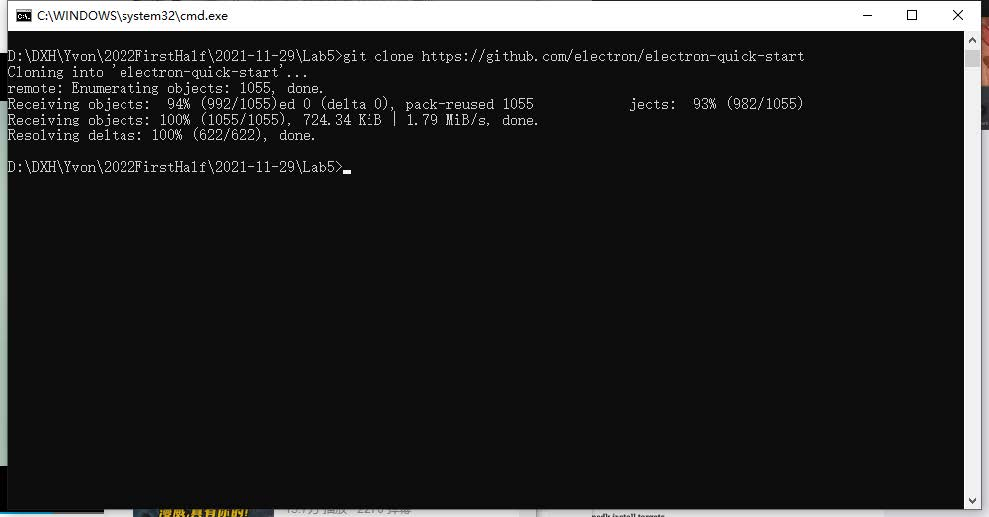
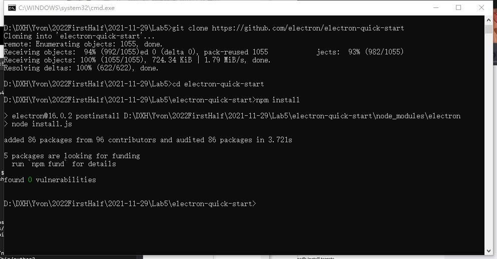
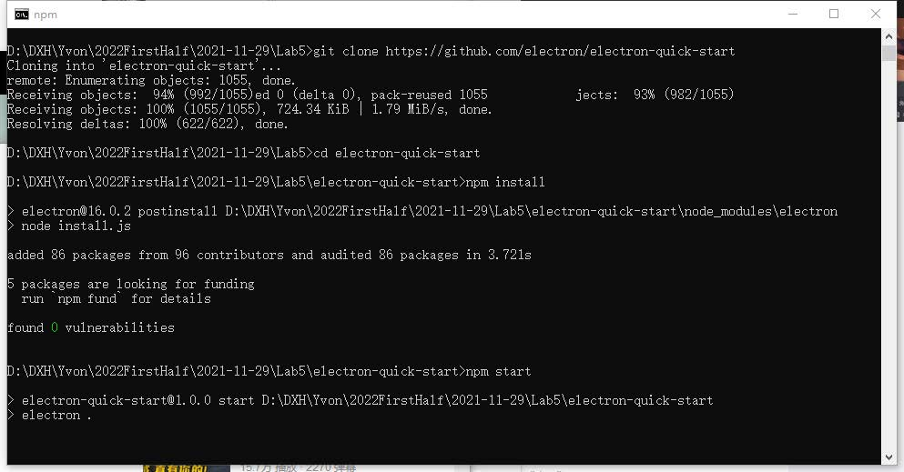
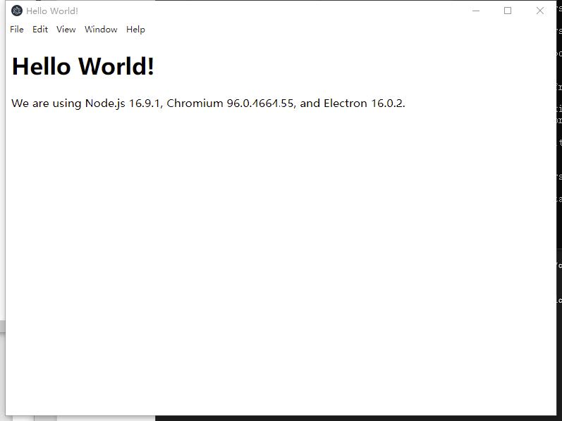
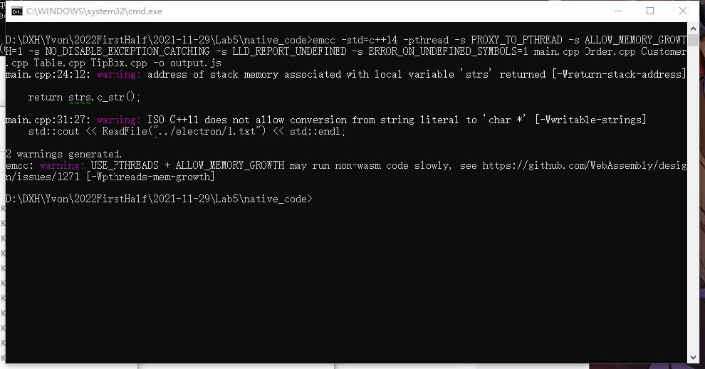
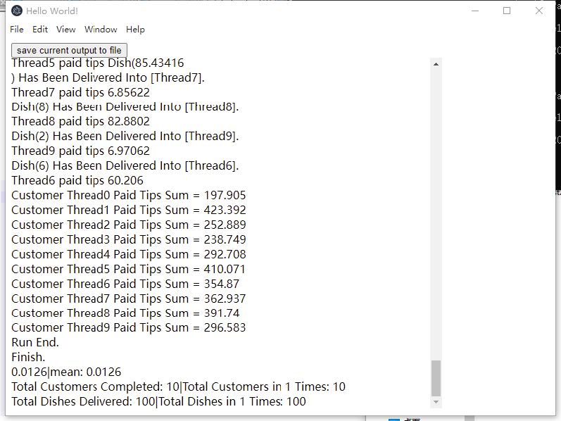
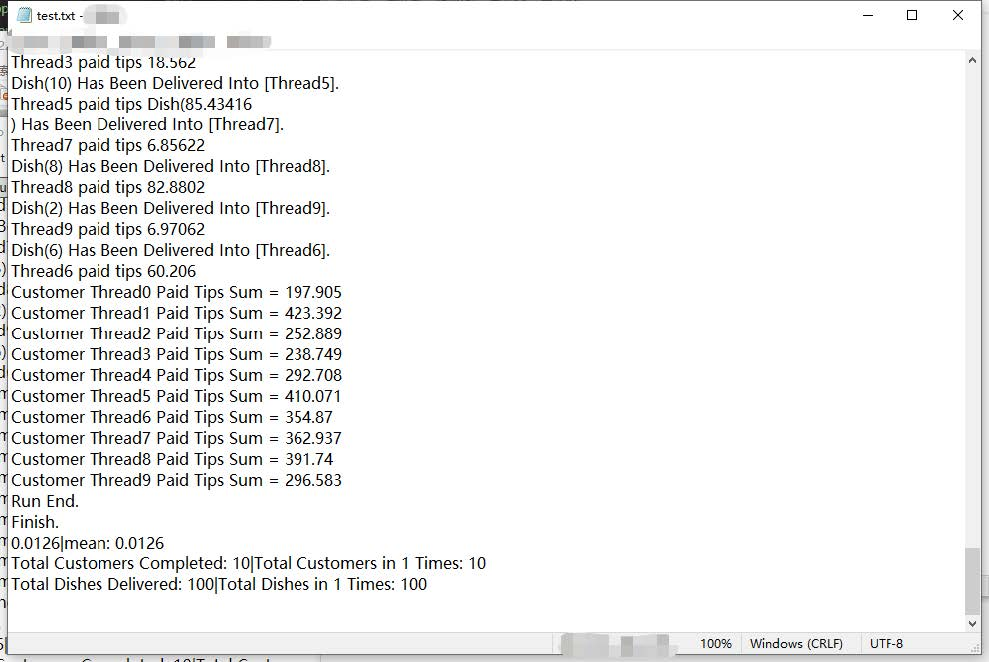

## Welcome to GitHub Pages (Lab5)

### ***Back to [Home](../)***

### ***[Download](https://github.com/Yvonhu/repo/tree/main/Lab5)***

### The all steps to get Emscripten development environment working.

#### Clone electron_quick_start to the local folder from a remote location.

Screenshot.1
> - Commands used in the screenshot.1:
>   - `Git clone https://emscripten.org/docs/getting_started/downloads.html.git`

#### Go to the electron_quick_start folder in your local terminal and install the modules.

Screenshot.2
> - Commands used in the screenshot.2:
>   - `Cd electron-quick-start`
>   - `Npm install`

#### Test Hello World!

Screenshot.3

Screenshot.4
> - Commands used in the screenshot.3&4:
>   - `Npm start`

### Compile source code.
#### Compile the native C++ source code in the terminal using emcc.

Screenshot.5
> - Commands used in the screenshot.5:
>     - `emcc -std=c++14 -pthread -s PROXY_TO_PTHREAD -s ALLOW_MEMORY_GROWTH=1 -s NO_DISABLE_EXCEPTION_CATCHING -s LLD_REPORT_UNDEFINED -s ERROR_ON_UNDEFINED_SYMBOLS=1 main.cpp Order.cpp Customer.cpp Table.cpp TipBox.cpp -o output.js`

#### Copy the generated .wasm file and .js file to the electron-quick-start folder.
---
#### Edit index.html and main.js on top of the original one, and create table.js as a new feature, whose function is to save all the performance data inside the final generated app
---
#### Execute npm start to test the final local app generated by the electron method.

Screenshot.6

#### As shown in screenshoot6, the "save current output file" button is added to the newly created feature, and we finally test the performance of the feature.

Screenshot.7

### ***[Download](https://github.com/Yvonhu/repo/tree/main/Lab5)***

### ***Back to [Home](../)***